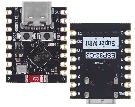
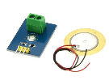
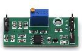
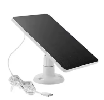
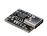
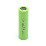
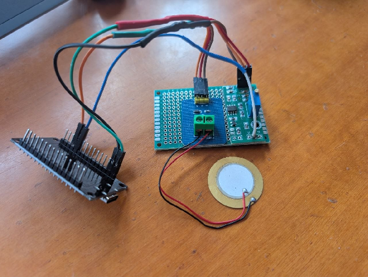

# KNOCK KNOCK IoT Project 

# Devboard

Initially our devboard of choice was the one suggested by the course, the ESP32 DevKit V1 (DOIT). Following experimentation with the INA219 energy consumption sensor, we encountered an unexpected deep sleep leakage of 1.5mA ca. Our hypothesis is that on-board hardware devices such as the voltage regulator or the USB-UART bridge may be responsible for this, as they are not designed for low consumption. 

As a first measure, the solution proposed was to eliminate useless devices that couldn’t be immediately disabled: the on-board LED was dissoldered because we weren’t able to find a clear way to power it down. 

|  | Deep Sleep | Light Sleep | Baseline (Active) |
| :---- | :---- | :---- | :---- |
| **ESP32 V1** | 3.5mA | 6mA | 37 mA |
| **ESP32 V1 (NO LED)** | 1.9 mA | 3.5mA | 35 mA |
| **ESP32 V4** | 3.5mA  | 9 mA | 35 mA |
| **ESP32-C3** | 50 µA | 0.8 mA | 20 mA |

To address issues related to power consumption, a viable solution is the use of the **ESP32-C3 Super Mini** module, which features a drastically lower deep-sleep current (\~50 µA).

However, this choice involves certain technical trade-offs: the ESP32-C3 utilizes a **single-core RISC-V** processor, unlike the dual-core system found in the DevKit V1. This necessitates more precise software optimization, particularly when managing computationally intensive processes such as **FFT (Fast Fourier Transform)** calculations.

# 

# Wake-up Module

To wake the ESP from deep sleep, the **LM393** module was chosen. This is a dual comparator that compares the voltage generated by the piezoelectric sensor against a reference threshold (typically set via a potentiometer). When the piezo signal exceeds this threshold, the chip toggles the digital output, converting the mechanical vibration into a pulse readable by a microcontroller.

To further conserve energy, the LEDs were desoldered from both the ESP and the LM393 module. Subsequent analysis with an **INA219** reported a constant power consumption of approximately **1.5 mA**. By replacing the LM393 with a **TLC393** module (soldered in its place), it will be possible to reduce the consumption to approximately **\~11 µA**.

This drastic difference is due to the nature of the components: **Bipolar** technology versus **CMOS** technology. The **LM393** uses Bipolar Junction Transistors (BJTs), which are current-controlled; this results in a baseline consumption of about **0.4 mA to 1 mA** per comparator.

In contrast, the **TLC393** is built using TI’s **LinCMOS** technology. These MOSFET-based circuits are voltage-controlled and have extremely high input impedance. Because they don't require a constant flow of electrons to maintain their state, they draw almost zero current when the signal is static. This allows the quiescent current to drop to a mere **\~6–11 µA**, which is essentially "electronic silence."

### **Ease of Integration**

A crucial advantage of this upgrade is that the **TLC393 is pin-to-pin compatible** with the LM393. According to our findings, both chips use the standard 8-pin layout (DIP or SOIC), where Pin 8 is VCC​ and Pin 4 is Ground and feature an open-drain output configuration, meaning existing pull-up resistor logic remains valid and functional.

By making this "silent" hardware swap, the largest bottleneck is effectively removed from the power budget, allowing the system to remain vigilant for vibration events for an extended period of time on a single charge.

# Connectivity Technologies and Protocols

Initially, **Bluetooth Low Energy (BLE)** was considered due to its renowned energy efficiency. However, the project eventually transitioned to **ESP-NOW** to maximize the **link budget** by leveraging the **2.4 GHz Wi-Fi Physical Layer (PHY)**, which provides significantly better obstacle penetration and range in indoor environments.

The adoption of this **connectionless, MAC-to-MAC protocol** eliminates the topological constraints of BLE (which is typically limited to \~7 active slave nodes per Piconet), enabling seamless horizontal scalability for the sensor network.

### **Temporal and Energetic Optimization**

From a timing perspective, ESP-NOW offers a decisive advantage by eliminating the overhead associated with stack initialization and BLE connection intervals (which typically require **5 to 10 ms**).

* **Transmission Efficiency:** ESP-NOW allows for payload transmission in just **1–2 ms**.  
* **Active Wake-up Time (AWK):** By reducing the radio-on time by approximately **80%** compared to BLE, the system minimizes its "Active Wake-up Time."  
* **Energy Balancing:** Although the Wi-Fi radio has a higher peak current (\~200-300 mA) compared to BLE (\~15-20 mA), the drastic reduction in duration (Tactive​) results in a lower total energy consumption (E=P×t) per transmission cycle.

### **Theoretical Energy Calculation**

To quantify this advantage, we can compare a typical transmission event (V=3.3V):

| Protocol | Peak Current (Ipeak​) | Duration (t) | Energy Consumed (E) |
| ----- | ----- | ----- | ----- |
| **BLE (Connectable)** | \~15 mA | \~10 ms | 15mA×10ms=150μC |
| **ESP-NOW** | \~240 mA | \~1.5 ms | 240mA×1.5ms=360μC |

While the raw energy per pulse is higher for ESP-NOW, the **protocol overhead** for maintaining a mesh or managing reconnections in a noisy environment often makes BLE more "expensive" in real-world IoT scenarios. Furthermore, the **ESP32-C3** can return to Deep Sleep (consuming only **\~50 µA**) much faster, optimizing the overall battery life cycle.

### **Hub Reliability and Redundancy**

The central **Hub** serves as the bridge between the sensor network and the end-user. Although it is primarily powered directly by the **electrical grid** to handle the continuous processing load, it is equipped with an integrated **lithium battery backup**.

This uninterruptible power supply (UPS) logic ensures that:

1. **Critical Alerts:** Vibration detections or security breaches are communicated even during a power outage.  
2. **System Integrity:** The Hub remains active to log events locally until grid power is restored.

# Power Supply \+ Energy Harvesting

This project integrates a **2600mAh 18650 lithium battery** paired with a charging protection module that supports a maximum charging current of **1A**. For units installed on windows with favorable exposure, a **solar panel** can be connected to the module to supplement the power supply via direct sunlight. Under optimal lighting conditions, we measured a charging current of approximately **10mA**.

While we do not expect this solution to achieve a full charge in low-light environments or adverse weather conditions, it serves as an effective **trickle charger**. This small current is sufficient to offset the quiescent current of the sensors and the deep-sleep consumption of the ESP32-C3, significantly extending the interval between manual recharges—or even achieving power neutrality in high-exposure locations.

# Actuators

The system incorporates an **active buzzer** with a dual function: it serves as an audible actuator (siren) during alarm events and acts as the **central hub** of the network.

To maximize energy efficiency, the window sensors communicate directly with this hub using low-power protocols (ESP-NOW), bypassing the need for individual Wi-Fi connections. **Wi-Fi connectivity** is utilized exclusively by the hub to manage remote communication, cloud integration, and sensor coordination.

# Security and Confidentiality

Lo scambio dei messaggi tramite EspNow verrà effettuata utilizzando la cifratura AES gestita direttamente dall’hardware 

# Components Table

|  | NAME | DESCRIPTION | technical features |
| :---- | :---- | :---- | :---- |
|  | ESP32 C3 SUPER MINI |  | è stato dissaldato il led per ridurne il consumo in deep sleep che è di \~50 µA |
|  | PIEZOELECTRIC SENSOR | sensore che permette di misurare le vibrazioni dell’ambiente. ha una dimensione di 27 mm e un modulo che ha integrato un diodo di protezione per la scheda in modo che se dovesse generare un voltaggio superiore ai 3.3v non rovini la scheda esp e una resistenza di 1M di pull down | consumo 0, genera corrente se scosso da vibrazioni |
|  | LM393 | comparatore analogico usato per svegliare l’esp dalla deep sleep quando il sensore piezoelettrico rileva una vibrazione sopra una certa soglia, che fa si che il pin out di questo modulo abbia tensione 3.3v in modo da generare l’interrupt | consumo 1.5 mah, considerato attualmente problematico per la durata della batteria. utilizzando il modulo TLC393 si riuscirà ad abbassare il consumo  \~11 µA, saldandolo al posto dell’lm393  |
|  | SOLAR PANEL | per ricaricare la batteria a litio, il problema è che necessita di luce diretta del sole, rendendo difficile l’uso per finestre esposte al nord |  |
|  | **Module Type-C Protection Board** | usato come protezione per la ricarica della batteria a litio che alimenta il sistema |  |
|  | Lithium battery 2000mh | batteria che alimenta il sistema | 2000 mah |

  

